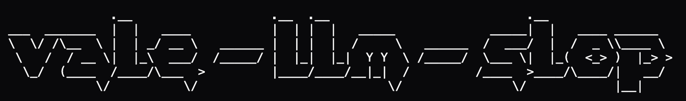

Works with [Vale](https://vale.sh).

> Let me first find the code before I jump to conclusions. Now I have the full picture, `vale-llm-slop` is the wedge in your prose grained provenance seam. It acts as the load-bearing mechanism for a golden set of prose in your projects.


In simpler terms, `vale-llm-slop` tells agents to use less, more simple words. This style is inspired by english standards which are apart of most modern model training sets, making linter an effective guide for agents as they work with the style guide.

## Make it load bearing

Add to your `.vale.ini`:

```ini
StylesPath = .vale
MinAlertLevel = warning
Packages = https://github.com/Syntaf/vale-llm-slop/releases/latest/download/vale-llm-slop.zip

# Docstrings and comments in source files. Add STE here if you want to be strict
[*.{py,cs,ts,tsx,js,go,rs,rb,java,kt,swift,php,c,cpp,h}]
BasedOnStyles = Slop

# Agent-authored specs, plans and docs. Enforce STE (strict)
[*.md]
BasedOnStyles = Slop, STE
```

**Slop** catches writing that sounds like AI wrote it. Comments that just repeat the code, buzzwords like "robust" and "delve", fake enthusiasm, empty praise. If Slop flags something, it's probably genuinely bad writing.

**STE** checks whether writing follows a strict documentation standard. Short sentences, no passive voice, no contractions, one instruction at a time. The writing it flags isn't necessarily bad — it just doesn't follow the standard. This style is much more opinionated and thus is an opt-in on top of slop.

## The smoking gun

### `Slop` Before → after

*More examples in: [examples/slop-violations.md](examples/slop-violations.md)*

`Slop.Metaphor`:

```diff
- > This document is historical provenance only — do NOT implement it.
+ > Out of date; kept as a record. Do not implement.
```

`Slop.RestatesCode`:

```diff
- """Convenience function to record telemetry"""
+ """Module-level shortcut for get_telemetry().record()."""
```

`Slop.EmptyQualifiers`:

```diff
- /// Called via Animation Event during the attack animation.
- /// Triggers the projectile to fire at the appropriate frame.
+ /// Animation Event on the attack clip's release frame: fires the arrow.
```

`Slop.Anthropomorphism`:

```diff
- /// How a shot finds the moving thing it cares about at play time.
+ /// How a shot resolves its subject at play time: the player, nearest
+ /// enemy or ally, a tag, or a name match.
```

`Slop.Vocabulary`:

```diff
- raising Compute alone barely moves the needle until the cost is enormous
+ raising Compute alone barely shortens the wait until the cost is enormous
```

`Slop.SelfPraise`:

```diff
- Expected: All edge cases handled gracefully, no null reference errors
+ Expected: CurrentTarget switches to null after the last target dies;
+ no NullReferenceException in the console.
```

`Slop.Overused`:

```diff
- ✅ Comprehensive error handling and validation
+ (deleted — the five lines above it already list what was built)
```

### `STE` Before -> After

*More examples in: [examples/ste-violations.md](examples/ste-violations.md)*

`STE.SentenceLength`

```diff
- First, the save/load path — the thing that IS the player's progress — has a
- confirmed, irreversible data-loss vector: a corrupt active-save read silently
- returns null with no backup, boots a fresh game on the same id, and lets the
- next 30s autosave overwrite the unreadable file, …
+ The save path is the player's progress, and it has a confirmed, irreversible
+ data-loss vector. A corrupt save read returns null with no backup. The game
+ then boots fresh on the same id. The next 30-second autosave overwrites the
+ unreadable file.
```

`STE.PassiveVoice`

```diff
- 1. Architecture contract is genuinely enforced, not aspirational: …
+ 1. The asmdef enforces the architecture contract: …
```

`STE.Dictionary`

```diff
- Treat the percentage portion of Effect as data
+ Treat the percentage part of Effect as data
```


### Slop — agent prose

| Rule | Catches | Level |
|---|---|---|
| `Metaphor` | Analogy standing in for mechanism: *reads as the*, *acts as a*, *load bearing against*, *provenance*, *grain-matched*, *is essentially a* | warning |
| `RestatesCode` | Comments that paraphrase the signature: *This function returns*, *Loop through each*, *Initialize the result variable* | warning |
| `EmptyQualifiers` | Adjectives that narrow nothing: *the appropriate handler for the given request* | warning |
| `SelfPraise` | Rating the code instead of explaining it: *ensures correctness*, *handles this gracefully*, *best practice* | warning |
| `VagueReasons` | A reason slot with no reason in it: *for various reasons*, *due to the nature of* | warning |
| `Ceremony` | Throat-clearing: *Note that*, *Under the hood*, *At a high level* | suggestion |
| `Anthropomorphism` | Intentions code does not have: *the parser wants*, *knows about* | suggestion |

### Slop — general machine cadence

| Rule | Catches | Level |
|---|---|---|
| `NegativeParallelism` | *It's not just X — it's Y*, *not only … but also* | warning |
| `Assistant` | Chat voice in committed prose: *Great question*, *I hope this helps* | error |
| `Vocabulary` | *delve*, *tapestry*, *paradigm shift*, *let's dive in* | warning |
| `Overused` | *robust*, *seamless*, *comprehensive*, *leverage* | suggestion |
| `Hedging` | *should probably*, *consider whether*, *we may want to* | suggestion |
| `EmDash` | More than two em-dashes in one paragraph | suggestion |
| `Tricolon` | *gracefully, quickly, and reliably* | suggestion |
| `Headers` | *Key Takeaways*, *A Deep Dive*, *Why X Matters* | suggestion |
| `Transitions` | *Moreover,*, *Ultimately,*, *At its core,* | suggestion |

### STE — ASD-STE100 writing rules

`SentenceLength` (25 words), `ProcedureLength` (20 words in list items),
`ParagraphLength` (6 sentences), `Articles`, `Gerunds`, `PassiveVoice`,
`NounClusters`, `Ambiguity` (*and/or*, *etc.*, *e.g.*), `Modals`
(*shall* → *must*), `Contractions`, `OneInstruction`, `Dictionary`.

`STE` is stricter than most teams want on ordinary prose. Scope it to the docs
that need it:

```ini
# Opt-in: procedures and runbooks that need ASD-STE100 discipline.
[docs/procedures/**.md]
BasedOnStyles = Slop, STE
```

**The STE Dictionary is not included.** ASD holds copyright on the ~900-word
approved list, so `Dictionary.yml` ships ordinary plain-English substitutions
instead. See [docs/ste-dictionary.md](docs/ste-dictionary.md) for how to build
the full rule locally from your own copy of the specification.


## Tuning

Turn anything off per-path:

```ini
[legacy/**/*.py]
Slop.RestatesCode = NO
```

Exclude the styles themselves if you lint your whole repo — the rule files
quote the phrases they ban:

```ini
[styles/**]
BasedOnStyles = ""
```

## Tests

```sh
./scripts/test.sh          # uses `vale` from PATH
VALE=/path/to/vale ./scripts/test.sh
```

Two properties are asserted: every rule fires at least once on a dirty fixture
(no dead rules), and the clean fixtures produce **zero** alerts (no false
positives). Currently 28 rules, 82 alerts on the dirty fixtures, 0 on the clean
ones.

## A note on the author

This repo was written by an LLM agent, but the README was produced by me, a human, who cares about the readability of their LLM generated code. My `Slop` style is the first draft of what I feel matters in LLM prose.

Open to contributions if anyone feels I missed anything big!

## Licence

MIT. See [LICENSE](LICENSE). Not affiliated with or endorsed by ASD.
